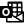
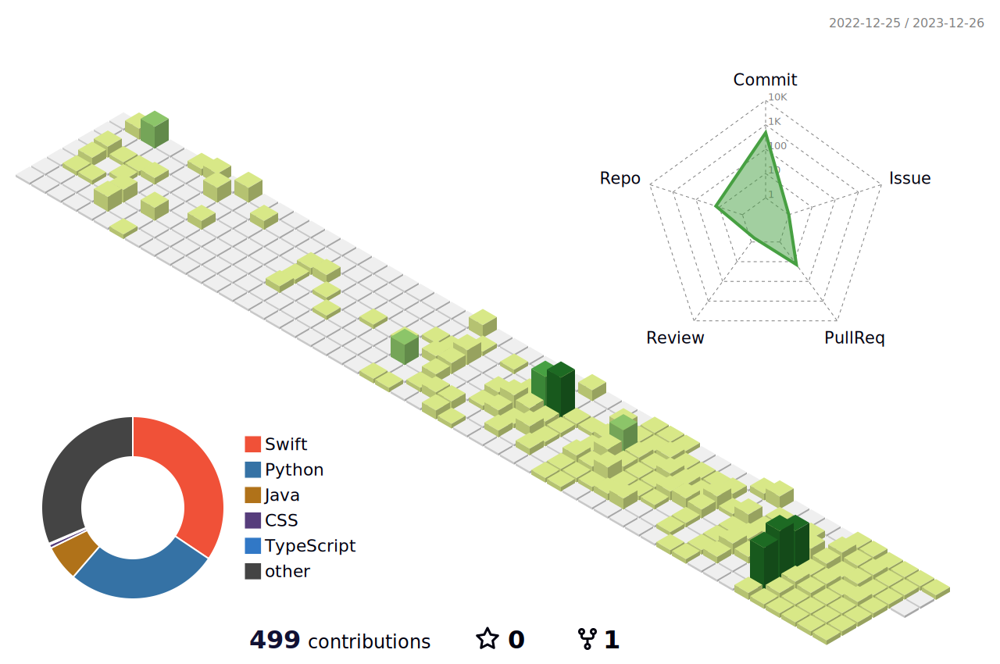

## **반갑습니다, 길지훈입니다** 👋

**- 🔭 I’m currently studying on iOS App Developement**  
**- 🌱 I’m currently learning SwiftUI**  
**- 👯 I’m doing various computing activities in the MOBICOM lab.**  
**- 🤔 I’m looking for help with RxSwift :-)**  
**- 💬 Ask me about Swift & SwiftUI**  
**- ⚡ Fun fact: I spend most of my time watching football games. (My cheer team is Arsenal.)**  

### Programming Languages  :rocket:
| |  |  |
|:---:|:---:|:---:|
### Tools :fire:
|| | | |
|:---:|:---:|:---:|:---:|

### Connect with me  :smiley:

  

